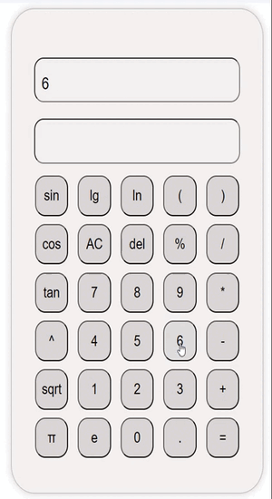
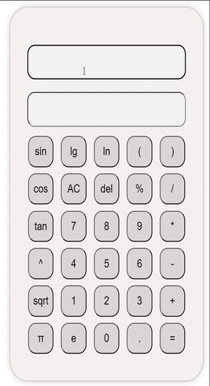
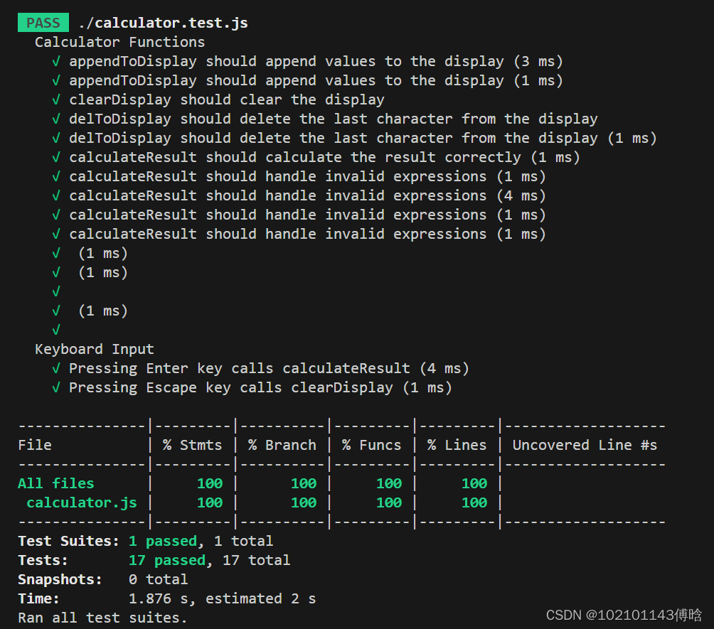

# calculator
### 文章目录

- - [项目地址](https://editor.csdn.net/md?articleId=133392430#_2)
  - [PSP表格](https://editor.csdn.net/md?articleId=133392430#PSP_12)
  - [解题思路描述](https://editor.csdn.net/md?articleId=133392430#_38)
  - [设计和实现过程](https://editor.csdn.net/md?articleId=133392430#_46)
  - [关键代码展示](https://editor.csdn.net/md?articleId=133392430#_133)
  - [性能改进](https://editor.csdn.net/md?articleId=133392430#_309)
  - [单元测试](https://editor.csdn.net/md?articleId=133392430#_346)
  - [心得体会](https://editor.csdn.net/md?articleId=133392430#_418)


## 项目地址

按键输入


键盘输入


## PSP表格

| PSP                                     | Personal Software Process Stages        | 预估耗时（分钟） | 实际耗时（分钟） |
| --------------------------------------- | --------------------------------------- | ---------------- | ---------------- |
| Planning                                | 计划                                    | 20               | 10               |
| • Estimate                              | • 估计这个任务需要多少时间              | 15               | 10               |
| Development                             | 开发                                    | 780              | 750              |
| • Analysis                              | • 需求分析 (包括学习新技术）            | 200              | 130              |
| • Design Spec                           | • 生成设计文档                          | 20               | 15               |
| • Design Review                         | • 设计复审                              | 20               | 20               |
| • Coding Standard                       | • 代码规范 (为目前的开发制定合适的规范) | 30               | 30               |
| • Design                                | • 具体设计                              | 60               | 60               |
| • Coding                                | • 具体编码                              | 180              | 210              |
| • Code Review                           | • Code Review                           | 30               | 30               |
| • Test                                  | • 测试（自我测试，修改代码，提交修改）  | 120              | 180              |
| Reporting                               | 报告                                    | 120              | 120              |
| • Test Repor                            | • 测试报告                              | 40               | 45               |
| • Size Measurement                      | • 计算工作量                            | 10               | 10               |
| • Postmortem & Process Improvement Plan | • 事后总结, 并提出过程改进计划          | 50               | 45               |
|                                         | 合计                                    | 920              | 880              |

## 解题思路描述

> - 由于计算器的本质就是计算算数表达式，当然可以使用栈来实现，但是这样子过于复杂，想到JavaScript/python可以直接运算算数表达式，所以打算使用JavaScript
> - 使用HTML可以把计算器作为一个网页应用程序轻松部署到互联网上，用户只需打开浏览器就可以使用。这使得计算器可以被广泛分享和访问，无需用户安装额外的软件。
> - 使用CSS和HTML，你可以轻松定制计算器的外观和用户界面，以满足特定的需求。你可以设计漂亮的按钮、添加背景图片、调整颜色和字体等。
> - JavaScript是一种相对容易学习和使用的语言，特别适合快速开发小型项目，如简易计算器。你可以在短时间内创建一个功能完善的计算器。

## 设计和实现过程

1. 包含了一个全局的字符串 expr，用于保存用户输入的表达式。

```javascript
let expr = '';
```

2.check()函数，

> 这个函数用于更新 expr 变量，以确保它与显示器的内容保持同步，当使用键盘输入时，就可以将键盘输入的值加到expr上

```javascript
function check() {
    expr = document.getElementById('display').value;
}
```

3.appendToDisplay() 函数，

> 当用户按下的按键值（数字、运算符等）附加到表达式字符串中，并更新显示器上的文本

```javascript
function appendToDisplay(value) {
    check();
    expr += value;
    document.getElementById('display').value = expr;
    check();
}
```

4.clearDisplay() 函数

> 该函数用于清除显示器（‘display’ 和 ‘display2’）上的文本，以便用户可以重新输入表达式

```javascript
function clearDisplay() {
    check();
    expr = '';
    document.getElementById('display').value = '';
    document.getElementById('display2').value = '';
    check();
}
```

5.delToDisplay() 函数

> 用于删除表达式字符串中的最后一个字符，并更新显示器上的文本

```javascript
function delToDisplay() {
    check();
    expr = expr.slice(0, -1);
    document.getElementById('display').value = expr;
    check();
}
```

6.calculateResult() 函数。

> 1.它尝试将表达式中的一些常见数学函数和常量替换为 JavaScript 中的 Math 对象的函数或常量。
> 2.它使用 eval()函数计算表达式的值
> 3.接下来，它将结果格式化为最多保留十位小数的数字，并将结果显示在名为 ‘display2’ 的元素中。
> 4.如果计算出错，即结果不是数字，它会将’error’ 显示在 ‘display2’ 中

```javascript
	function calculateResult() {
	    check();
	    try {
	        expr = expr.replace(/lg/g, 'Math.log10').replace(/ln/g, 'Math.log').replace(/sqrt/g, 'Math.sqrt').replace(/sin/g, 'Math.sin').replace(/\^/g, '**').replace(/cos/g, 'Math.cos').replace(/tan/g, 'Math.tan').replace(/e/g, 'Math.E').replace(/pi/g, 'Math.PI').replace(/abs/g, 'Math.abs');
	        expr = eval(expr);
	        expr = formatNumber(expr);
	        if (!/[0-9\.]/.test(String(expr))) expr = 'error';
	        document.getElementById('display2').value = expr;
	    } catch (error) {
	        document.getElementById('display').value = '';
	        document.getElementById('display2').value = 'error';
	    }
	    check();
	}
```

7.代码简洁，并且包含了一些对常用数学函数的替换，这增强了计算器的功能性，可扩展能力强，可以很容易的添加其他数学函数

## 关键代码展示

**calculator.js**

```javascript
document.addEventListener("keydown", function (event) {
    const key = event.key;
    if (key == "Enter") {
        calculateResult();
    } else if (key == "Escape") {
        clearDisplay();
    }
});


let expr = '';

function appendToDisplay(value) {
    check();
    expr += value;
    document.getElementById('display').value = expr;
    check();
}

function clearDisplay() {
    check();
    expr = '';
    document.getElementById('display').value = '';
    document.getElementById('display2').value = '';
    check();
}

function formatNumber(number) {
    if (Number.isInteger(number)) {
        return number; // 如果是整数，直接返回整数
    } else {
        return parseFloat(number.toFixed(10)); // 如果是小数，保留10位小数并返回
    }
}
function delToDisplay() {
    check();
    expr = expr.slice(0, -1);
    document.getElementById('display').value = expr;
    check();
}
function calculateResult() {
    check();
    try {
        expr = expr.replace(/lg/g, 'Math.log10').replace(/ln/g, 'Math.log').replace(/sqrt/g, 'Math.sqrt').replace(/sin/g, 'Math.sin').replace(/\^/g, '**').replace(/cos/g, 'Math.cos').replace(/tan/g, 'Math.tan').replace(/e/g, 'Math.E').replace(/pi/g, 'Math.PI').replace(/abs/g, 'Math.abs');
        expr = eval(expr);
        expr = formatNumber(expr);
        if (!/[0-9\.]/.test(String(expr))) expr = 'error';
        document.getElementById('display2').value = expr;
    } catch (error) {
        document.getElementById('display').value = '';
        document.getElementById('display2').value = 'error';
    }
    check();
}


function check() {
    expr = document.getElementById('display').value;
}
```

**calculator.html**

```html
<!DOCTYPE html>
<html lang="en">
<head>
    <meta charset="UTF-8">
    <meta name="viewport" content="width=device-width, initial-scale=1.0">
    <title>简单计算器</title>
    <link rel="stylesheet" href="calculator.css">
</head>
<body>
    <div class="calculator">
        <input type="text" id="display" onkeydown="check()" >
        <input type="text" id="display2" readonly >
        <div class="buttons">
		<button onclick="appendToDisplay('sin(')">sin</button>		
		<button onclick="appendToDisplay('lg(')">lg</button>
		<button onclick="appendToDisplay('ln(')">ln</button>
		<button onclick="appendToDisplay('(')">(</button>
		<button onclick="appendToDisplay(')')">)</button>
		<br>
		<button onclick="appendToDisplay('cos(')">cos</button>
		<button onclick="clearDisplay()">AC</button>
		<button onclick="delToDisplay()">del</button>
		<button onclick="appendToDisplay('%')">%</button>
		<button onclick="appendToDisplay('/')">/</button>
		<br>	
		<button onclick="appendToDisplay('tan(')">tan</button>
		<button onclick="appendToDisplay('7')">7</button>
		<button onclick="appendToDisplay('8')">8</button>
		<button onclick="appendToDisplay('9')">9</button>
		<button onclick="appendToDisplay('*')">*</button>
		<br>
		<button onclick="appendToDisplay('^')">^</button>
		<button onclick="appendToDisplay('4')">4</button>
		<button onclick="appendToDisplay('5')">5</button>
		<button onclick="appendToDisplay('6')">6</button>
		<button onclick="appendToDisplay('-')">-</button>
		<br>
		<button onclick="appendToDisplay('sqrt(')">sqrt</button>
		<button onclick="appendToDisplay('1')">1</button>
		<button onclick="appendToDisplay('2')">2</button>
		<button onclick="appendToDisplay('3')">3</button>
		<button onclick="appendToDisplay('+')">+</button>
		<br>
		<button onclick="appendToDisplay('pi')">π</button>
		<button onclick="appendToDisplay('e')">e</button>
		<button onclick="appendToDisplay('0')">0</button>
		<button onclick="appendToDisplay('.')">.</button>
		<button onclick="calculateResult()">=</button>
			</div>
    </div>
    <script src="calculator.js"></script>
</body>
</html>
```

**calculator.css**

```css
body {
    display: flex;
    justify-content: center;
    align-items: center;
    height: 100vh;
    margin: 0;
}

.calculator {
    text-align: center;
    background-color: #f5f1f1;
    border: 1px solid #b1aeae;
    padding: 50px 20px 20px 20px;
    border-radius: 35px;
    box-shadow: 0 0 10px rgba(0, 0, 0, 0.2);
    width: 340px; /* 设置宽度 */
    height: 530px; /* 设置高度 */
    
}

input[type="text"] {
    width: 85%;
    background-color: #f3f1f1;
    padding: 20px 10px 10px;
    margin-top:10px;
    margin-bottom: 10px;
    font-size: 20px;
    border-radius: 14px;
}

.buttons button {
    background-color: #dbd6d6;
    width: 50px;
    height: 50px;
    font-size: 18px;
    margin: 5px;
    border-radius: 15px;
    cursor: pointer;
}

.buttons button:hover {
    background-color: #ddd;
}
```

## 性能改进

1. **用事件监听器实现键盘输入**
   document.addEventListener(“keydown”, function (event) { …
   }) 用于监听键盘按键事件。
   如果用户按下 “Enter” 键，它会调用 calculateResult()函数来计算表达式的结果。
   如果用户按下 “Escape” 键，它会调用 clearDisplay() 函数来清除显示器上的文本。
   如果用户按下其他键，就会显示到输入框中，然后触发check()函数，将显示框的值赋给expr

2. **优化精度问题**

   ```javascript
   function formatNumber(number) {
       if (Number.isInteger(number)) {
           return number; // 如果是整数，直接返回整数
       } else {
           return parseFloat(number.toFixed(10)); // 如果是小数，保留10位小数并返回
       }
   }
   ```

```
在JavaScript中	0.2 + 0.1 = 0.30000000000000004，因为浮点数运算在计算机中可能会引入精度问题。在这种情况下，0.2 和 0.1 都是浮点数，并且它们的精确表示形式在计算中可能导致微小的精度损失。这是计算机二进制浮点数表示法的一个常见问题。所以我选择先判断一个数是不是整数，然后把小数保留10位，将末尾的0去掉，这样0.2 + 0.1 = 0.3 。

```

## 异常处理

```javascript
if (!/[0-9\.]/.test(String(expr))) expr = 'error'
```

> expr不是数字时，输出 ‘error’ ,比如 1/0 或者 10^1000 溢出 或者输出 NAN 时

## 单元测试

本项目使用jest进行单元测试

1. appendToDisplay 测试：

   对 appendToDisplay 函数进行测试，检验其是否能够将值附加到显示器。

   ```javascript
   test('appendToDisplay should append values to the display', () => {
       appendToDisplay('5');
       expect(document.getElementById('display').value).toBe('5');
     });
   ```

2.**clearDisplay 测试:**
对 clearDisplay 函数进行测试，检验其是否能够清除两个显示字段。
测试在显示器中设置初始值，然后调用 clearDisplay，检查两个显示字段是否都为空。

```javascript
test('clearDisplay should clear the display', () => {
    document.getElementById('display').value = '123';
    clearDisplay();
    expect(document.getElementById('display').value).toBe('');
    expect(document.getElementById('display2').value).toBe('');
  });
```

1. **delToDisplay 测试：**
   对 delToDisplay 函数进行测试，检验其是否能够从显示器中删除最后一个字符。

   ```javascript
   test('delToDisplay should delete the last character from the display', () => {
       document.getElementById('display').value = '123';
       delToDisplay();
       expect(document.getElementById('display').value).toBe('12');
     });
   ```

2. **calculateResult 测试：**
   对 calculateResult 函数进行测试，检验其是否能够计算结果并处理无效的表达式。提供了各种测试用例，包括有效的计算（‘2+2’ -> ‘4’）、无效的表达式（‘2+’ -> ‘error’）、除以零的情况（‘1/0’ -> ‘error’）、小数计算（‘0.1+0.2’ -> ‘0.3’）以及更复杂的表达式。

   ```javascript
   test('calculateResult should calculate the result correctly', () => {
       document.getElementById('display').value = '2+2';
       calculateResult();
       expect(document.getElementById('display2').value).toBe('4');
     });
   
     test('calculateResult should handle invalid expressions', () => {
       document.getElementById('display').value = '2+';
       calculateResult();
       expect(document.getElementById('display2').value).toBe('error');
     });
   
     test('calculateResult should handle invalid expressions', () => {
       document.getElementById('display').value = '1/0';
       calculateResult();
       expect(document.getElementById('display2').value).toBe('error');
     });
   ```

3. **键盘输入测试**：
   提供了两个测试来模拟键盘事件，并确保调用相应的函数：
   第一个测试模拟按下 Enter 键，并检查是否调用了 calculateResult。
   第二个测试模拟按下 Escape 键，并检查是否调用了 clearDisplay。

4. **优化测试覆盖率**
   1.边界情况：添加更多的测试用例，以覆盖边界情况和边界条件，特别是对于复杂的数学表达式或非传统的用户输入。
   2.负面测试：包括有意触发错误条件的测试，以确保健壮的错误处理。

5. **单元测试覆盖率：**
   

## 心得体会

1.在开始编写代码之前，对项目的需求和规格进行仔细的分析和理解非常关键。这有助于确定功能的范围，确保代码满足预期的要求。
2.学会了编写单元测试，编写单元测试是保证代码质量的关键步骤。它们不仅有助于捕获和修复错误，还可以确保代码在未来的修改中不会产生意外问题。
3.学习了HTML、CSS和JavaScript，加强前端开发技能，提高HTML、CSS和JavaScript的应用能力，同时体验用户界面设计和用户交互的方面。